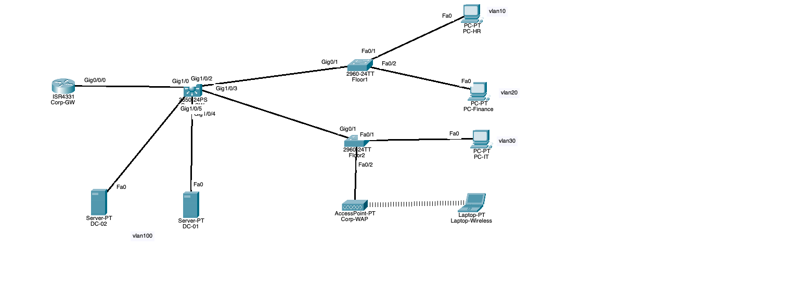

# Hybrid Identity Corporate Network Lab

## 📌 Project Overview
This portfolio project showcases a fully functional, production-modeled enterprise infrastructure lab. The architecture combines a **Cisco Layer 3 Collapsed Core network topology** with a centralized **Active Directory Domain Services (AD DS)** environment, cross-VLAN DHCP/DNS relay routing, and structural planning for Microsoft Entra ID hybrid cloud synchronization.

## 📊 Network Architecture Diagram


## ⚙️ Technical Specifications & Core Design

### 1. Network Segmentation & VLAN Scheme
The corporate intranet is partitioned into isolated broadcast domains to optimize bandwidth, minimize broadcast storms, and enforce strict security boundaries at the core layer:
* **VLAN 10 (HR Department):** `192.168.10.0/24` (SVI Gateway: `10.1.1.1` via Router Relay)
* **VLAN 20 (Finance Department):** `192.168.20.0/24`
* **VLAN 30 (IT Support):** `192.168.30.0/24`
* **VLAN 100 (Server Infrastructure):** `192.168.100.0/24`

### 🔑 2. Identity & Access Management (Active Directory & Microsoft Entra ID Cloud Sync)
Rather than utilizing decentralized consumer network elements, all critical business operational services are hosted within the **Server Infrastructure VLAN (VLAN 100)**:
* **DC-01 (Primary Domain Controller & DNS/DHCP):** Host IP `192.168.100.10`. Resolves the local domain namespace (`corp.local`). Manages central IP leasing across all endpoint subnets using Cisco `ip helper-address` SVI relay configuration.
* **DC-02 (Identity Cloud Sync Host):** Host IP `192.168.100.11`. Designated as a staging host for the **Microsoft Entra Cloud Sync Agent**. 
* **Hybrid Cloud Design Concept:** In a production environment, the Entra Cloud Sync lightweight agent establishes a secure outbound connection (TLS Port 443) from DC-02 straight to a Microsoft 365 tenant. This enables Password Hash Synchronization (PHS) to seamlessly map local user objects onto Microsoft Entra ID cloud endpoints.

### 🔒 3. Cisco Infrastructure Hardening & Review
The foundational edge router (`Corp-GW`) and core switch nodes are locked down using industry-standard engineering baselines:
* **Logging Visibility:** Overrode default parameters to explicitly enable `service timestamps log datetime msec` for precise millisecond auditing during incident responses.
* **Credential Protection:** Applied `service password-encryption` to enforce cryptographic obfuscation across all active VTY and physical Console lines.
* **Typo Protection:** Disabled unsafe lookups using `no ip domain-lookup` to maximize terminal uptime.
* *Note: For testing and review purposes, all virtual network appliances use the standard lab password credential: `cisco`.*

## 🏁 How to Verify & Inspect This Architecture
1. Clone or download this repository to your workstation.
2. Launch the file within `/topology/corporate_network_topology.pkt` via Cisco Packet Tracer.
3. Open any client workstation (e.g., HR-PC), navigate to the Desktop Command Prompt, and execute:
   ```text
   ipconfig /all      <-- Confirm successful dynamic server IP allocation
   nslookup corp.local <-- Validate operational Active Directory DNS mapping
   ```
